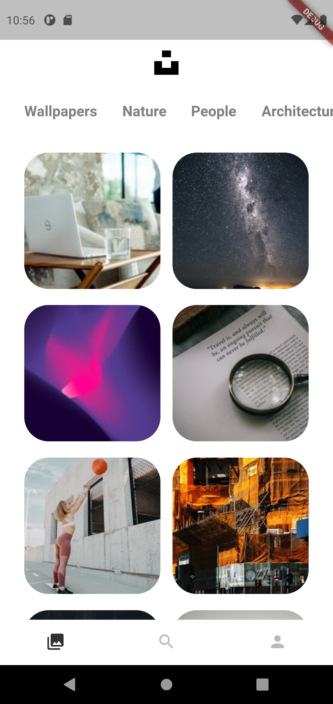
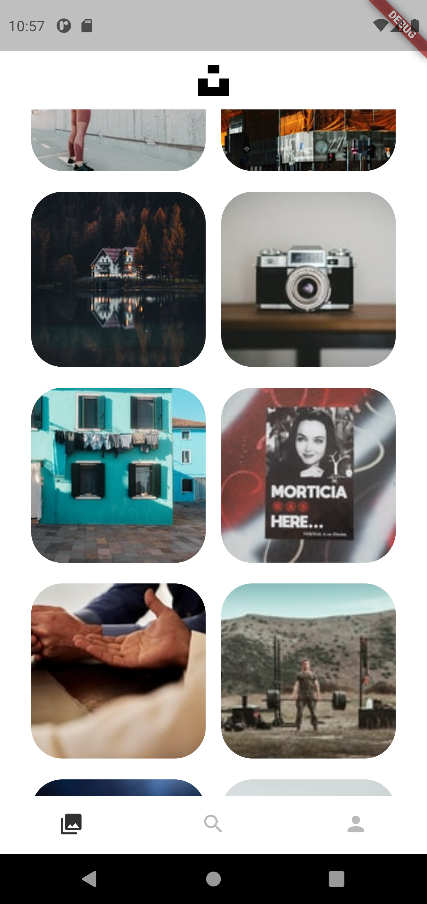
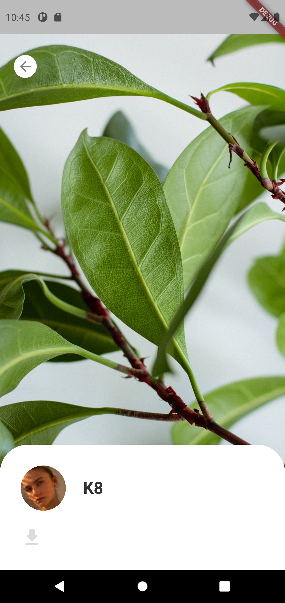

# Unsplash Mobile
Ứng dụng chia sẻ ảnh trên nền tảng di động mô phỏng trang Web [Unsplash](https://unsplash.com/).

## Mục lục

- [Thông tin chung](#thông-tin-chung)
- [Công nghệ](#công-nghệ)
- [Mô tả ứng dụng](#mô-tả-ứng-dụng)
- [Cài đặt](#cài-đặt)

## Thông tin chung
Dự án là nội dung bài tập lớn thuộc học phần Ứng dụng di động cho điện toán đám mây (INT3122 20), Đại học Công Nghệ (UET) - Đại học Quốc gia Hà Nội (VNU), học kì II, năm học 2020 - 2021.

Nhóm 10:
- Phạm Đắc Ngọc Nhật (17021312)
- Thiều Minh Thịnh (17021340)
- Nguyễn Đình Nhật Minh (17021298)

## Công nghệ

- [Dart](https://dart.dev/overview)
- [Flutter](https://flutter.dev/)

## Screenshots

  
  
    
  
  
  

## Kết quả kiểm thử

    

## Cài đặt
